# 🎯 Market Analytics Bot

> **Real-time market signals bot for CS:GO skins.** Watches new items on LIS-SKINS (WebSocket), compares them against real Market.CSGO prices, filters out garbage, and pushes profitable signals to Telegram + a Streamlit dashboard.


---

## ✨ Features

### Data Pipeline
- **Real-time ingestion** — Centrifuge WebSocket (`public:obtained-skins`) with an async queue (maxsize 5000) and a worker to survive event floods
- **Market price polling** — Market.CSGO price list (~340k items) refreshed every 60s
- **Robust payload parser** — handles 4 different WebSocket payload formats
- **DB auto-migration** — schema upgrades on startup (`PRAGMA` + `ALTER TABLE`)

### Arbitrage Intelligence
- **Ignores fake prices** — on P2P marketplaces one seller can list a $0.78 item for $87k. The bot trusts real data instead:
  1. `avg_price` — average of actual 7-day sales
  2. `buy_order` — real buy offers (bids)
  3. `ask price` — last resort, guarded by sanity limits
- **Garbage protection**:
  - liquidity filter (`popularity_7d`)
  - minimum absolute profit in € (not just %) — kills "1600% profit" illusions on micro-trades
  - sanity cap: `market_price / buy_price > 10` → skipped as data anomaly (a cheap $0.5 → $3 flip is a legit +500%, so the cap is generous)
  - auto-cleanup of signals with `profit_percent > 500%` on every startup
- **Deduplication** — by `lis_item_id` (UNIQUE constraint)

### Notification & Visualization
- **Telegram bot** — stats, status, configurable filters via `/update_field` (with examples)
- **User allowlist** — only authorized Telegram IDs can use the bot
- **Live latency metric** — WebSocket event latency (ms) exposed in bot status/stats
- **Streamlit dashboard** — ROI, profit €, time-series scatter, TOP-10, distribution histogram, CSV export
- **Tunneled dashboard access** — share the dashboard via a free public URL (cloudflared → auto-fallback to SSH localhost.run) without hosting; optional "Open Dashboard" button in the bot menu

---

## 🎯 Who Is This For?

**Resellers who want profit, not gaming knowledge.**

You don't need to know:
- What "StatTrak™ M4A4 | Howl" is
- Why "Karambit | Fade" costs $2000
- How CS:GO skins work

You just need:
- A LIS-SKINS API key
- A Market.CSGO account
- This bot

The bot handles the rest: filters noise, finds real profit, sends signals.

## 🔄 How It Works

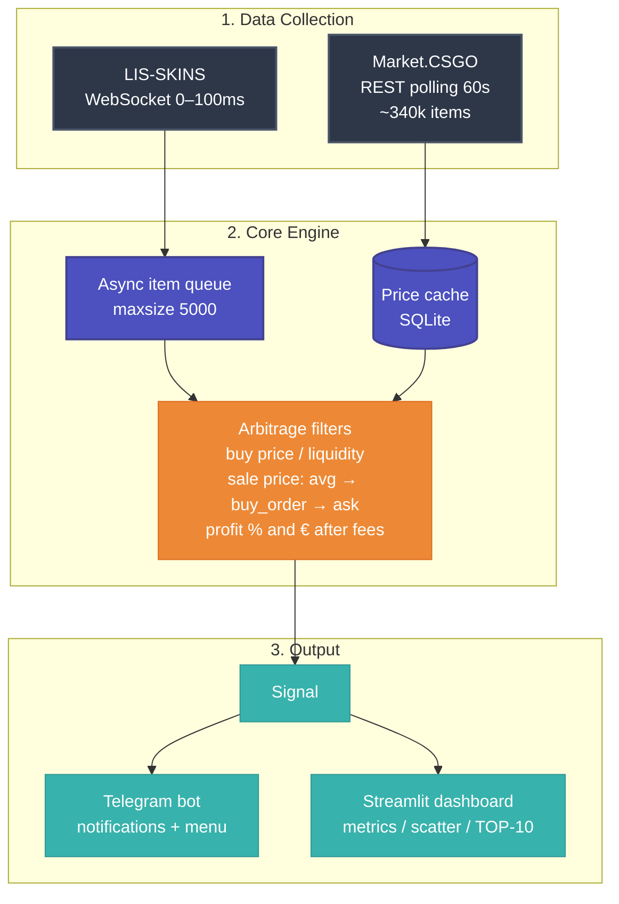

---

## 📁 Project Structure

```
arbitrage_bot/
├── main.py                       # entry point: starts all loops
├── config.py                     # env-based config (.env)
├── shared_state.py               # shared runtime metrics (e.g. WebSocket latency)
├── start_dashboard.py            # launch Streamlit + cloudflared tunnel
├── requirements.txt
├── .env                           # secrets (NOT committed)
│
├── api/
│   ├── lis_skins_ws.py           # Centrifuge WebSocket client + async queue
│   └── market_csgo.py            # price polling parser
│
├── analyzer/
│   └── metrics.py                # arbitrage logic & filters
│
├── storage/
│   └── db.py                     # SQLite, migrations, settings
│
├── notifications/
│   ├── telegram_app.py           # Telegram bot menu (stats/settings/status)
│   └── telegram_bot.py           # signal notifications
│
└── dashboard/
    └── app.py                    # Streamlit analytics dashboard
```

---

## 🚀 Setup

### 1. Prerequisites

- Python 3.11+
- LIS-SKINS API key
- Telegram Bot token (+ your chat id)

### 2. Environment

Create your own `.env` (there is no committed `.env.example` — keep secrets private):

```ini
# .env
LIS_SKINS_API_KEY=your_lis_skins_api_key
TELEGRAM_BOT_TOKEN=your_telegram_bot_token
TELEGRAM_CHAT_ID=your_chat_id

# --- Recommended: user allowlist ---
# Only these Telegram user IDs can use the bot. Find yours via @userinfobot.
# Comma-separated. Leave empty to disable the allowlist (open to everyone).
ALLOWED_USER_IDS=123456789

# --- Optional: public dashboard URL (see "Dashboard behind a tunnel") ---
# DASHBOARD_URL=

# Settings (optional)
MARKET_CSGO_CURRENCY=EUR
MIN_PROFIT_PERCENT=15
MARKET_CSGO_FEE_PERCENT=5
SAFETY_PERCENT=3
MARKET_REFRESH_SECONDS=60
```

### 3. Run

```bash
pip install -r requirements.txt
python main.py
```

### 4. Dashboard (local)

In a separate terminal:

```bash
streamlit run dashboard/app.py
```

### 5. Dashboard behind a tunnel (no hosting)

Get a free public URL for the dashboard without deploying anywhere:

```bash
python start_dashboard.py
```

How it works:
1. Launches Streamlit locally.
2. Tries **cloudflared** (if the binary is present) — and actually verifies
   the URL responds with HTTP 200. If the network blocks Cloudflare
   (UDP/TCP 7844 blocked ⇒ 530 error), it automatically falls back to an
   **SSH tunnel via localhost.run** (needs only OpenSSH, built into Windows).
3. Prints the public URL and auto-writes `DASHBOARD_URL` into your `.env`.

The bot re-reads `DASHBOARD_URL` lazily on every menu render, so the
**🧭 Open Dashboard** button always points to the current tunnel URL —
no bot restart needed.
Note: the tunnel URL lasts while the script is running.

---

## ⚡ Performance

- **WebSocket latency:** 0-100ms (LIS-SKINS → queue)
- **Market polling:** ~340k items every 60s
- **Queue throughput:** handles event floods (maxsize 5000)
- **Memory footprint:** ~50-100MB (SQLite + async workers)
- **Uptime:** 24/7 on VPS (systemd service)

## 🤖 Telegram Bot

| Command | Description |
|---|---|
| `/start` | Opens main menu (Stats / Settings / Status) |
| `/update_field <key> <value>` | Change a filter setting |
| `/status` | Show current settings |

`/status` additionally shows the **latest WebSocket latency** (ms), updated live from the event stream.

> **Access control:** only users listed in `ALLOWED_USER_IDS` can use the bot.
> Anyone else gets ignored (no reply), so a randomly-discovered bot is useless to outsiders.

### Filterable Fields

| Key | Default | Meaning |
|---|---|---|
| `min_price` | `0` | min buy price on LIS (€) |
| `max_price` | `1000` | max buy price on LIS (€) |
| `min_profit_percent` | `15` | min profit in % (after fees) |
| `min_abs_profit` | `0.3` | min profit in € — kills micro-garbage |
| `min_liquidity` | `1` | min 7-day sales popularity |
| `max_liquidity` | `1000` | max 7-day sales popularity |

Example:

```
/update_field min_abs_profit 5
→ ✅ Field min_abs_profit updated successfully.
```

---

## 📸 Screenshots

### 1. Telegram: main menu, status, stats & settings

<table>
  <tr>
    <td align="center"><b>Menu</b><br/>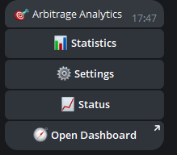</td>
    <td align="center"><b>Stats</b><br/>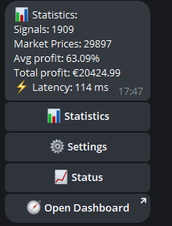</td>
  </tr>
  <tr>
    <td align="center"><b>Status</b><br/>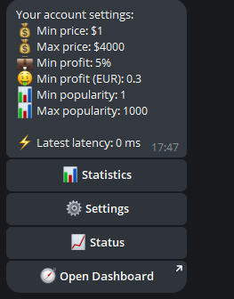</td>
    <td align="center"><b>Settings</b><br/>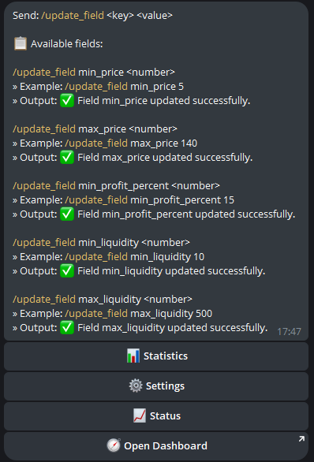</td>
  </tr>
</table>

### 2. Telegram: profitable signal notification

<p align="center">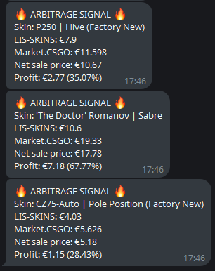</p>

### 3. Dashboard — top metrics

<p align="center">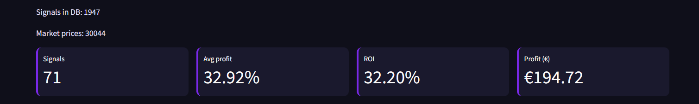</p>

### 4. Dashboard — time-series scatter

<p align="center">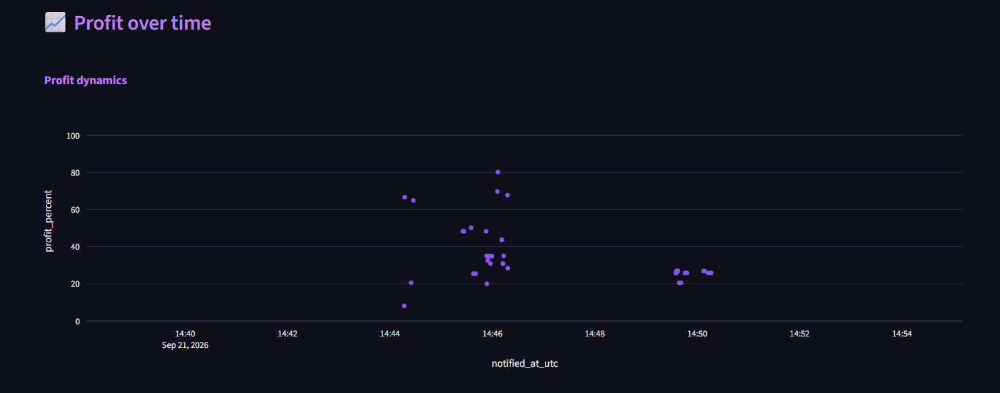</p>

### 5. Dashboard — TOP-10 table

<p align="center">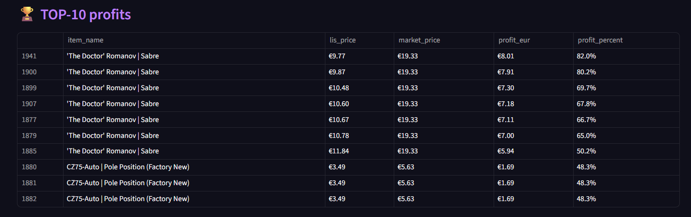</p>

### 6. Bot console / logs

<table>
  <tr>
    <td align="center">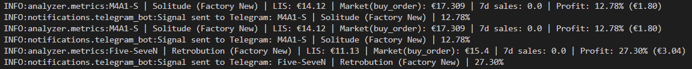</td>
    <td align="center">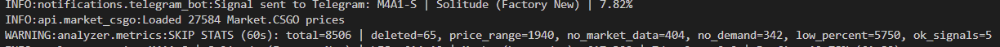</td>
  </tr>
</table>


---

## 🔮 Future Ideas

These are potential enhancements, not bugs:

- **Price history tracking** — store `avg_price` trends over time
- **Smart scoring** — profit × liquidity × sale speed
- **Backtesting** — validate filters on historical data
- **Bidirectional arbitrage** — warn when LIS is overpriced vs Market
- **Auto-buy (dry-run first)** — cooldowns, daily caps, manual confirm

Contributions welcome! Open an issue if you want to work on any of these.

---

## ⚠️ Disclaimer

Educational / data-analytics project. **Not financial advice.** Trading skins involves real money — use at your own risk. P2P price data may be manipulated by bots; always verify before relying on signals.
