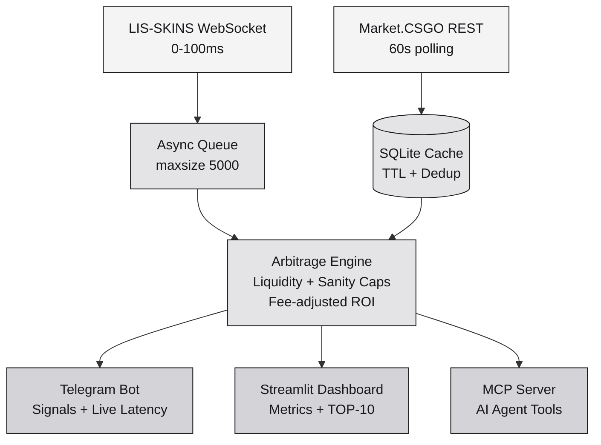

# CS2 Skins analytic bot

[](https://python.org)
[](https://docs.python.org/3/library/asyncio.html)
[]()
[](LICENSE)

</div>

> ⚡ Real-time P2P market arbitrage analytics engine. Sub-100ms WebSocket ingestion, multi-tier anomaly filtering, Streamlit dashboard, and MCP server for AI agents.

## Get started

```bash
# 1. Clone and setup environment
cp .env.example .env
# Edit .env with LIS_SKINS_API_KEY, TELEGRAM_BOT_TOKEN, ALLOWED_USER_IDS

# 2. Install dependencies (KISS approach: venv, no Docker)
python -m venv venv
source venv/bin/activate  # or `venv\Scripts\activate` on Windows
pip install -r requirements.txt

# 3. Run core engine
python main.py
```

> **Dashboard:** Run `python start_dashboard.py` in a separate terminal. It automatically provisions a public URL via `cloudflared` with an SSH (`localhost.run`) fallback if UDP/TCP 7844 is blocked.

---

## 🔋 Batteries Included

**📡 Data Pipeline**
- **Hybrid ingestion:** Centrifuge WebSocket (`public:obtained-skins`) for sub-100ms signals + REST polling (~340k items / 60s) as a freshness fallback.
- **Backpressure handling:** `asyncio.Queue` with `maxsize=5000` prevents OOM during event floods.
- **Resilient parsing:** Handles 4 distinct WebSocket payload formats gracefully.

**🧠 Arbitrage Intelligence**
- **Hierarchy of trust:** Prioritizes `avg_price` (7-day actual sales) → `buy_order` (real bids) → `ask_price` (guarded by sanity limits).
- **Noise filtration:** 
  - Absolute profit floor in € (kills "1600% profit" illusions on $0.01 micro-trades).
  - Liquidity filter (`popularity_7d`).
  - Sanity cap: `market_price / buy_price > 10` is auto-skipped as a data anomaly.
- **Data integrity:** Atomic deduplication via SQLite `INSERT OR IGNORE` on `lis_item_id`.

**📊 Observability & Control**
- **Telegram interface:** Whitelist-only access (`ALLOWED_USER_IDS`), live WebSocket latency metrics, and dynamic `/update_field` configuration.
- **Streamlit dashboard:** ROI tracking, time-series scatter plots, TOP-10 tables, and CSV export.
- **Auto-migration:** Schema upgrades (`PRAGMA` + `ALTER TABLE`) executed safely on startup.

**🤖 AI Agent Ready (MCP)**
- Built-in Model Context Protocol server exposing typed tools (`get_latest_signals`, `update_setting`) for LLM agents.
- Whitelist-validated tool execution prevents arbitrary state mutation.

---

## Why market-analytics-bot

Naive arbitrage bots compare raw listing prices and spam false positives. P2P marketplaces are saturated with:
- **Fake listings:** $0.78 items listed for $87k by a single seller.
- **Illiquid assets:** "Profitable" items with zero 7-day trading volume.
- **Micro-garbage:** Flips that do not cover platform fees.

**This engine filters noise, not just prices.** It delivers 5–10 high-confidence signals per day instead of 1000+ garbage alerts.

---

## How it works


```mermaid
graph TD
    classDef source fill:#f4f4f5,stroke:#18181b,color:#18181b,stroke-width:1px;
    classDef core fill:#e4e4e7,stroke:#18181b,color:#18181b,stroke-width:1px;
    classDef output fill:#d4d4d8,stroke:#18181b,color:#18181b,stroke-width:1px;

    A[LIS-SKINS WebSocket<br/>0-100ms]:::source --> C[Async Queue<br/>maxsize 5000]:::core
    B[Market.CSGO REST<br/>60s polling]:::source --> D[(SQLite Cache<br/>TTL + Dedup)]:::core
    
    C --> E[Arbitrage Engine<br/>Liquidity + Sanity Caps<br/>Fee-adjusted ROI]:::core
    D --> E
    
    E --> F[Telegram Bot<br/>Signals + Live Latency]:::output
    E --> G[Streamlit Dashboard<br/>Metrics + TOP-10]:::output
    E --> H[MCP Server<br/>AI Agent Tools]:::output
```

---

## ⚠️ Architectural Considerations

*For contributors and advanced users:*
1. **Rate Limiting:** Market.CSGO polling is empirically tuned to 60s intervals. Do not decrease `MARKET_REFRESH_SECONDS` below 45s without implementing exponential backoff, or you risk IP bans (HTTP 429).
2. **Concurrency:** SQLite operates in WAL mode (`PRAGMA journal_mode=WAL`) to prevent `database is locked` errors during concurrent reads (Dashboard) and writes (Ingestion worker).
3. **Floating-Point Math:** All financial calculations in `analyzer/metrics.py` strictly use `decimal.Decimal` to prevent precision loss during fee deductions.

---

## 🛠️ Management & Deployment

- **Local Dev:** `python main.py` + `streamlit run dashboard/app.py`
- **Production:** Deployed as a `systemd` service on a minimal VPS (1 vCPU, 1GB RAM). Memory footprint remains stable at ~50-100MB.
- **MCP Integration:** Add to Claude Desktop or Continue config:
  ```json
  {
    "mcpServers": {
      "market-analytics": {
        "command": "python",
        "args": ["mcp_server.py"]
      }
    }
  }
  ```

---

## License

MIT
